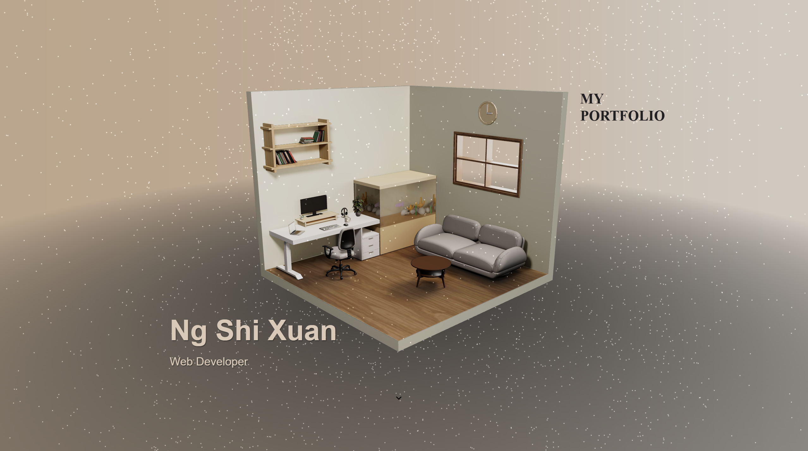

# Interactive 3D Room Portfolio

A personal portfolio website featuring an immersive and interactive 3D room built with React Three Fiber and GSAP. The camera and 3D objects animate based on the user's scroll position, creating a dynamic "scrolltelling" experience.

**[Live Demo][(https://room-portfolio-alpha.vercel.app/)]**



## About The Project

This project was created to showcase my skills in front-end development, 3D web graphics, and animation. The goal was to build a portfolio that is not just a list of projects, but an engaging experience in itself.

The main scene features a 3D model of a room that the user explores by scrolling. The camera pans and zooms, and the room itself moves and rotates to reveal different sections of the portfolio content, which is overlaid as standard HTML.

## Key Features

-   **Interactive 3D Scene:** Built with React Three Fiber, allowing for seamless integration of 3D graphics in a React application.
-   **Scroll-Based Animations:** Leverages GSAP (GreenSock Animation Platform) and its ScrollTrigger plugin to create complex camera and object animations that are perfectly synced with the page scroll.
-   **Smooth Scrolling:** Implemented with Lenis to provide a smooth, high-performance scrolling experience that is essential for animation timing.
-   **Responsive Design:** The 3D scene and HTML content are fully responsive, with different scales and layouts for desktop and mobile devices.
-   **Performance Optimized:** Uses techniques like memoization (`useMemo`) and Drei helpers to ensure a smooth frame rate.

## Tech Stack

-   **Frontend:** [React](https://reactjs.org/)
-   **3D Graphics:** [React Three Fiber](https://docs.pmnd.rs/react-three-fiber), [Drei](https://github.com/pmndrs/drei), [GLSL](https://thebookofshaders.com/)
-   **Animation:** [GSAP](https://greensock.com/gsap/), [ScrollTrigger](https://greensock.com/scrolltrigger/)
-   **Styling:** [Tailwind CSS](https://tailwindcss.com/)
-   **Smooth Scrolling:** [Lenis](https://github.com/studio-freight/lenis)
-   **Deployment:** [Vercel](https://vercel.com/)

## Getting Started

To get a local copy up and running, follow these simple steps.

### Prerequisites

-   Node.js (v16 or later)
-   npm

### Installation

1.  Clone the repo
    ```sh
    git clone https://github.com/your-username/your-repo-name.git
    ```
2.  Navigate to the project directory
    ```sh
    cd your-repo-name
    ```
3.  Install NPM packages
    ```sh
    npm install
    ```
4.  Run the development server
    ```sh
    npm run dev
    ```
    Open [http://localhost:5173](http://localhost:5173) (or whatever port is shown) to view it in your browser.

## Asset Creation

-   The 3D room model (`room.glb`) was custom-designed and modeled for this project using Blender.

## Contact

Shi Xuan - [shixuanx@gmail.com](mailto:shixuanx@gmail.com)
